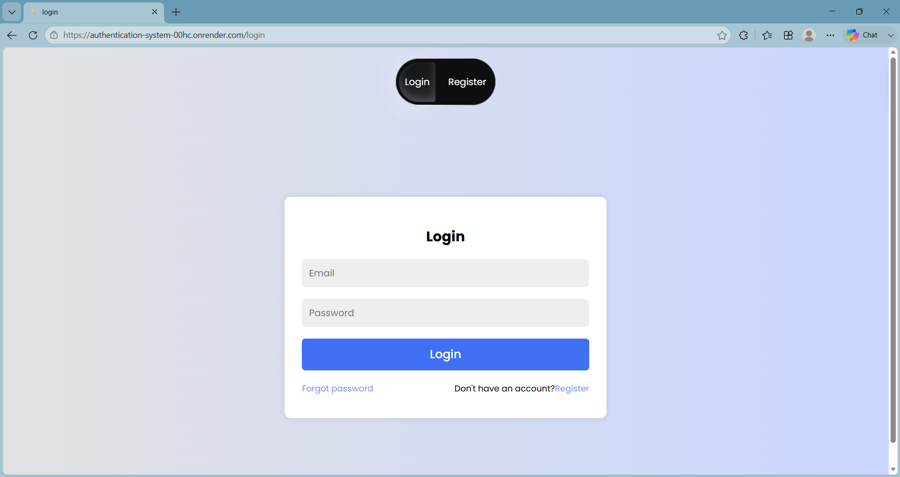
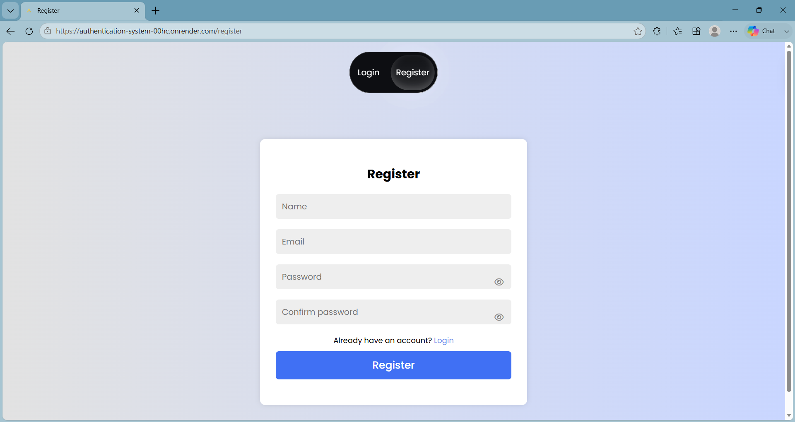
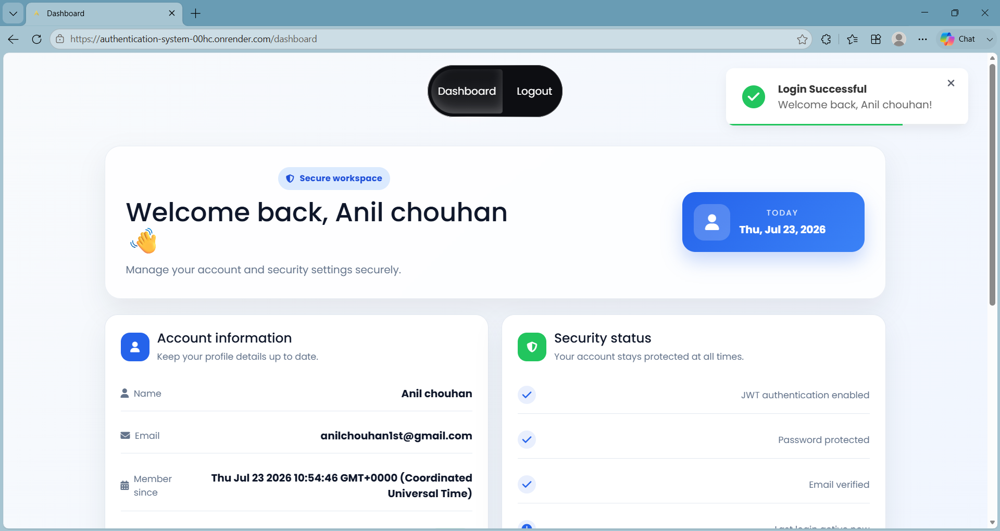
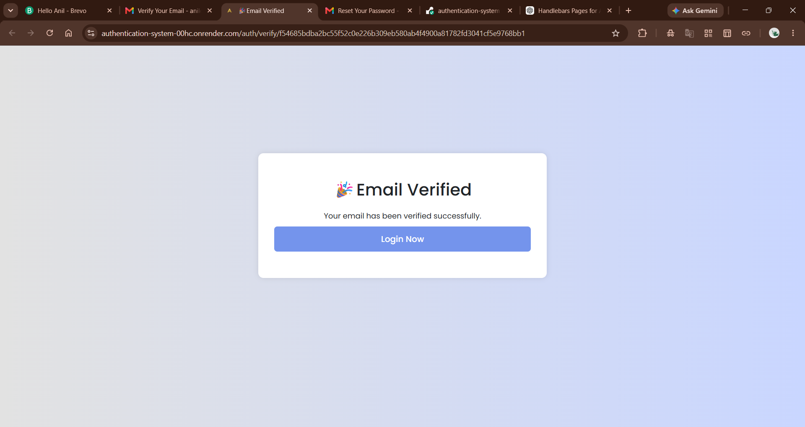
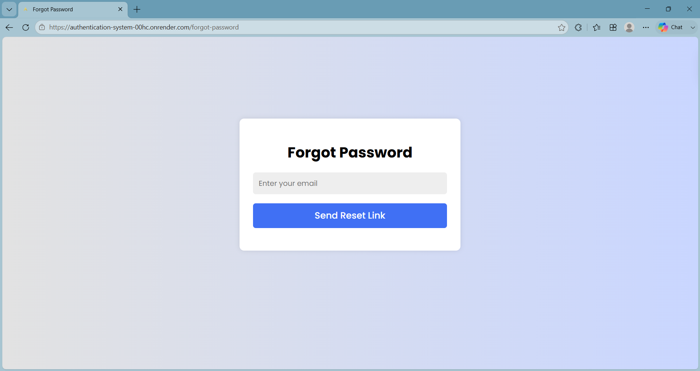
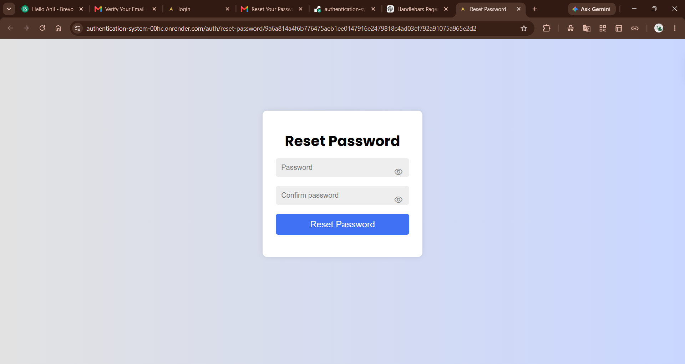
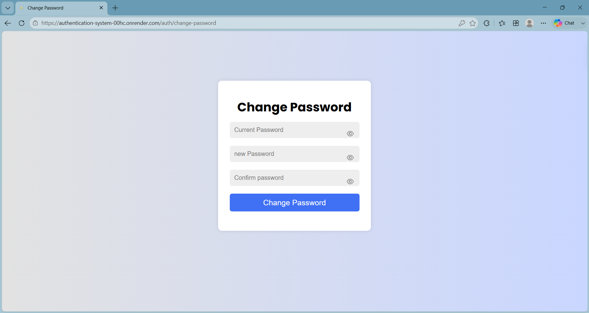

# 🔐 Authentication System

A secure full-stack authentication system built with **Node.js, Express.js, MySQL, and Handlebars**. It provides complete user authentication including email verification, password reset, JWT authentication, protected routes, and password management.

---

## 🌐 Live Demo

🔗 **Live Website:** https://authentication-system-00hc.onrender.com

---

## 📸 Screenshots

### Login Page



---

### Register Page



---

### Dashboard



---

### Email Verification



---

### Forgot Password



---

### Reset Password



---

### Change Password



---

## ✨ Features

### Authentication

- User Registration
- Secure Login
- JWT Authentication
- Protected Routes
- Logout Functionality

### Email Features

- Email Verification
- Forgot Password
- Password Reset via Email
- Transactional Emails using Brevo SMTP

### Security

- Password Hashing with bcrypt
- JWT-based Authentication
- Secure Cookies
- Password Strength Validation
- Login Rate Limiting
- Environment Variables for Sensitive Data

### User Experience

- Responsive UI
- Toast Notifications
- Password Visibility Toggle
- Real-time Password Validation
- Change Password (after login)

---

## 🛠️ Tech Stack

### Frontend

- HTML5
- CSS3
- JavaScript
- Handlebars (HBS)

### Backend

- Node.js
- Express.js

### Database

- MySQL (Railway)

### Authentication

- JSON Web Token (JWT)
- bcryptjs

### Email

- Brevo SMTP
- Nodemailer

### Other Packages

- cookie-parser
- dotenv
- express-rate-limit

---

## 📂 Project Structure

```
authentication-system/
│
├── controllers/
├── routes/
├── middleware/
├── config/
├── views/
│   ├── partials/
│   └── layouts/
├── public/
│   ├── css/
│   ├── js/
│   └── images/
├── screenshots/
├── app.js
├── db.js
├── package.json
└── README.md
```

---

## 🚀 Installation

### Clone Repository

```bash
git clone https://github.com/anilchouhan1st/authentication-system.git
```

### Open Project

```bash
cd authentication-system
```

### Install Dependencies

```bash
npm install
```

### Create Environment File

Create a `.env` file and add:

```env
PORT=5000

DATABASE_HOST=
DATABASE_PORT=
DATABASE_USER=
DATABASE_PASSWORD=
DATABASE=

JWT_SECRET=
JWT_EXPIRES_IN=

EMAIL_USER=
EMAIL_PASS=
EMAIL_FROM=

BASE_URL=http://localhost:5000
```

### Start Development Server

```bash
npm run dev
```

or

```bash
npm start
```

---

## 🔒 Security Features

- Passwords hashed using bcrypt
- JWT Authentication
- Secure HTTP Cookies
- Protected Dashboard
- Login Rate Limiting
- Email Verification
- Password Reset Tokens
- Strong Password Validation

---

## 📌 Future Improvements

- User Profile Management
- Profile Image Upload
- Remember Me Option
- Two-Factor Authentication (2FA)
- OAuth Login (Google & GitHub)
- Admin Dashboard
- Session Management

---

## 👨‍💻 Author

**Anil Chouhan**

GitHub: https://github.com/anilchouhan1st

LinkedIn: https://www.linkedin.com/in/anil-chouhan-ac2005/

---

## ⭐ Support

If you found this project helpful, consider giving it a ⭐ on GitHub!